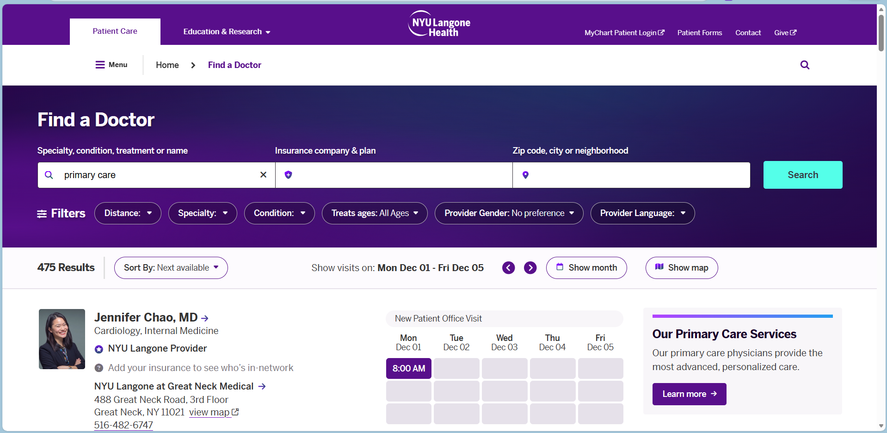

# Web Scraping NYU Langone Primary Care Providers



**Target website**: [Primary Care Doctors | NYU Langone Health](https://nyulangone.org/doctors/treatment/primary-care?sort=availability&page=1)


I built a web scraper in Python to extract structured data from NYU Langone’s Primary Care Doctors directory — names, specialties, locations, and scheduling info. See ````pages/sample_page1.json```` for a preview of the type of data that can be extracted.

## Tools :mechanical_arm:

- **Python**

- **Python Libraries**
    -   ``requests``
    -   ``json``

Using the lightweight but powerful ``requests`` library, I fetched the web page content efficiently. Then, the ``json`` library helped parse structured portions of data when available, turning raw HTML into a collection of JSON files ready to be manipulated and loaded into a database.

Combining these libraries demonstrates how simple it can be to unlock public healthcare data and make it more accessible for network analysis or patient matching without dealing with sensitive information.

For data scientists and engineers working in healthcare analytics, this project highlights how fundamental Python tools like requests and json provide a practical foundation for impactful scraping and data integration projects.

If you’re interested in scraping healthcare provider data or building data-driven tools for patient engagement, let's connect and share insights!